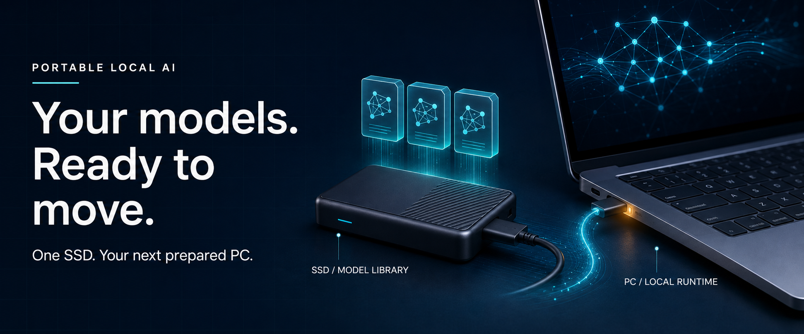
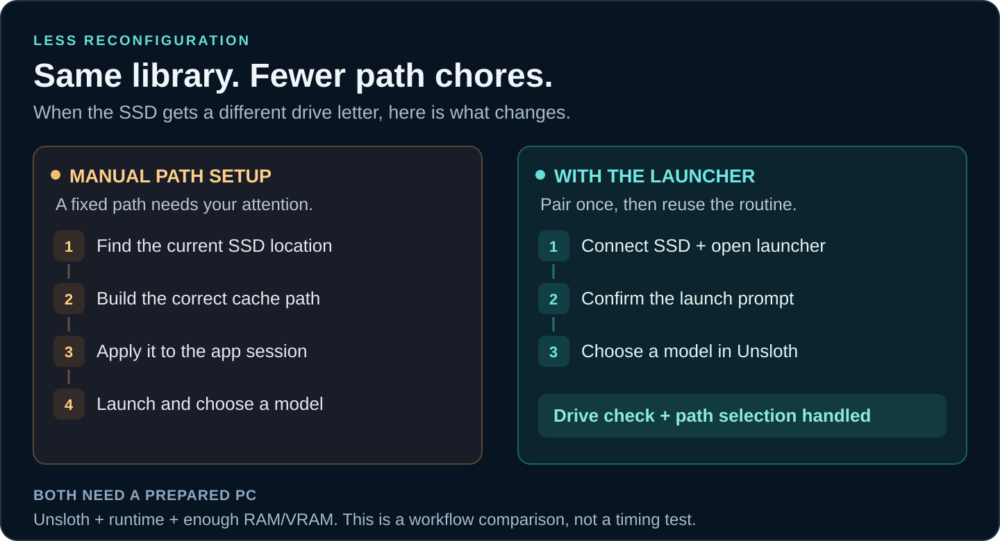
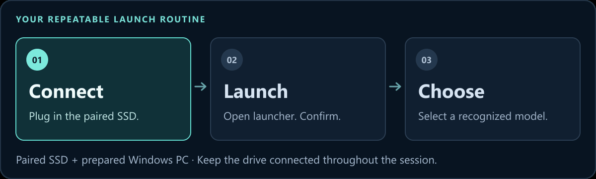

<a name="top"></a>



<h1 align="center">Portable Local AI Environment Manager</h1>

<p align="center">
  <strong>A privacy-first, plug-and-play workflow for prepared Windows PCs.</strong><br>
  Carry your model library on an external SSD. Automatically configure its cache path for the local Unsloth app, with guarded host-local storage for chats and credentials.
</p>

<p align="center">
  <a href="#quick-start"></a>
  <a href="#quick-start"></a>
  <a href="#status"></a>
  <a href="#quick-start"></a>
</p>

<p align="center">
  <a href="#why">See the difference</a> ·
  <a href="#quick-start">Set up your SSD</a> ·
  <a href="#daily-use">Everyday use</a> ·
  <a href="#questions">Explore the details</a>
</p>

> **Prototype, with a clear purpose.** The source records 97 passing local automated checks. A complete second-PC test is still pending. [See the evidence and remaining tests →](docs/testing.md)

<a name="why"></a>

## Your SSD moves. Windows drive letters do too.

You move your models off a crowded internal drive. Then you connect the SSD to another computer: yesterday's `F:` is today's `Z:`. The files are there, but your application still needs the right cache location.

**Pair once. Connect. Launch.** The launcher resolves the SSD's current location, checks its pairing marker and volume identity, asks for your consent, and starts the local Unsloth installation with the correct model cache. You do not need to edit paths or environment variables when the drive letter changes.

Once launched, **Unsloth discovers supported models from the selected cache**. The launcher connects the library to the app; recognition still requires complete model files and support in the installed Unsloth version.



### Six ways it simplifies the routine

| Key benefit | Configuring it yourself | With this launcher |
| :--- | :--- | :--- |
| **🔌 Plug-and-play after preparation** | Revisit the cache configuration when your storage setup changes. | Pair the SSD once and reuse its configuration on prepared PCs. No repeated drive pairing for a new drive letter. |
| **🧭 Dynamic drive detection** | Check and update paths that depend on a fixed drive letter. | PowerShell resolves the current drive using the pairing marker and filesystem volume serial. |
| **⚙️ Automatic paths and environment** | Set the cache through your app or environment workflow. | Build the cache path and set the new app process's environment at launch, leaving global Windows variables unchanged. |
| **🔒 Privacy-first storage** | Configure model, chat, and credential locations separately. | Share the model cache while keeping known chat and credential paths on the host, with checks before launch. |
| **🖱️ One launcher to open** | Open your app with the correct settings, or maintain your own startup script. | Double-click the batch launcher and approve the prompt. PowerShell handles the checks and configuration; an optional helper offers insertion prompts. |
| **🔁 A repeatable routine across PCs** | Repeat the path configuration and check for mistakes on each machine. | Reuse the same paired library and launch routine on prepared Windows PCs, one at a time. Each PC still needs its own app/runtime setup. |

A careful manual setup or your own script can achieve the same result. This project packages the repeated work into a reusable workflow, reducing opportunities for stale paths and ordinary wrong-drive mistakes. **The benefit is less repeated configuration; no setup-time **

### Where it earns its place

| 💾 A larger library | 🔁 A change of desk | 🎓 A repeatable demo |
| :--- | :--- | :--- |
| Keep model weights on external storage instead of using more internal space. | Carry the same complete cache between prepared Windows PCs, one at a time. | Use a documented launch routine, with a check command before you begin. |

**The SSD carries the models. Each PC supplies Unsloth, its runtime, and the RAM/VRAM to run them.** Model recognition still depends on the installed Unsloth version and a complete, supported cache.

<a name="quick-start"></a>

## From source files to your first launch

**Have these ready:**

- **A prepared Windows PC:** Windows PowerShell 5.1, Unsloth Desktop installed and initialized, suitable hardware, and permission to run these scripts.
- **An external SSD:** an existing NTFS or exFAT volume with enough free space. NTFS was used in the original prototype; exFAT still needs a real-device test.
- **A model folder:** start empty, or reuse a complete Hugging Face Hub cache. Loose weight files are not a Hub cache; preserve snapshot files and links when copying one. [Cache preparation details →](docs/setup.md)

Back up important files. Model weights, the Unsloth installer, accounts, and drivers are not included.

### 1 · Copy the launcher to the SSD

Download this repository using **Code → Download ZIP**, extract it, and copy `T5-Launcher/` plus all five root-level `.cmd` files to the **root of your SSD**:

```text
Your SSD/
├── T5-Launcher/
├── Configure-SSD.cmd
├── Check-Setup.cmd
├── Start-Unsloth-With-T5.cmd
├── Install-T5-Connection-Popup.cmd
└── Remove-T5-Connection-Popup.cmd
```

Keep these names. The `T5` filenames come from the original Samsung T5 prototype; pairing is not tied to that brand. Use a separate test drive if a launcher is already installed there.

### 2 · Pair once, check once

Double-click **`Configure-SSD.cmd`**. Choose the cache folder relative to the SSD, for example:

```text
AI\Models\huggingface\hub
```

Review the drive and folder, then type **`PAIR`**. Setup creates the cache folder if needed and writes `T5-Launcher/device.json`. Keep that device-specific file out of Git. A changed drive letter does not require pairing again.

Run **`Check-Setup.cmd`** for a read-only diagnostic before your first launch.

### 3 · Launch, verify, try a model

Fully quit Unsloth **and its background backend**. Double-click **`Start-Unsloth-With-T5.cmd`** and accept the prompt. If asked, select this PC's installed `unsloth-studio.exe`.

In Unsloth, verify that the active Hub cache points to the SSD. For an existing library, check **On Device**. For an empty library, open **Model hub**, download one small supported model, then load it and try a prompt. Gated models may require your own sign-in on this PC.

[Full setup guide →](docs/setup.md) · [Add or remove models →](docs/models.md)

<a name="daily-use"></a>

## Next session: connect → launch → choose a model



<sub>Illustrated workflow, not a screen recording. <a href="docs/assets/launch-flow.svg">View the static diagram.</a> The optional helper can offer the launch prompt after insertion.</sub>

**Manage the library inside Unsloth.** Use the app's model download and removal controls after verifying that the selected cache is on the SSD. The launcher supplies the storage location; Unsloth manages the model files. Changes to that shared cache affect subsequent users of the drive, while launcher-session credentials remain on the host. [Model-management guide →](docs/models.md)

<details>
<summary><strong>🔔 Make it more convenient: enable the connection popup</strong></summary>

Run `Install-T5-Connection-Popup.cmd` from the paired SSD once on each Windows account where you want prompts.

The local helper starts at sign-in and checks every five seconds. On a newly detected matching drive, it asks before launching Unsloth. Declining stays quiet for that insertion. The drive connected during installation is skipped; use the manual launcher for that first session.

A computer without the helper needs a double-click on the launcher. Plugging in alone does not run anything; this is not USB AutoRun. This version supports one paired drive per account's helper.

To disable it, run `Remove-T5-Connection-Popup.cmd`, also available in `%LOCALAPPDATA%\PortableLocalAI`. It removes its verified Startup shortcut and stops the watcher; helper files and logs remain.

</details>

**Before unplugging:** stop downloads and generation, unload models, quit Unsloth and its backend, then use Windows' eject action. Keep the SSD connected throughout a session; loaded models can still read from disk. Use one computer at a time with the writable cache.

## Share the library. Keep application state on each host.

**The intended split is simple: a shared model library, with personal application state kept locally.** The launcher does not copy your chat history or credentials onto the SSD. It routes known chat, authentication, and session-credential paths to the host and stops the launch if its privacy checks fail.

| Travels on the SSD | Stays on each prepared PC |
| :--- | :--- |
| Model weights, repositories, and cache metadata | Unsloth installation, runtime, and local chat/authentication state |
| Model additions and deletions that affect later users | Hugging Face credentials used by launcher sessions |
| Model names and filesystem timestamps | Launcher logs, temporary files, and session project defaults |

This is a storage boundary, not a guarantee that user data can never leave the host: the launcher does not control network access, cloud synchronization, or manual exports. Existing chats remain on the host; there is no incognito session or automatic cleanup. Anything you save to the SSD travels with it, and anyone who can read an unencrypted SSD can inspect its files. Keep private models, datasets, tokens, and backups off a drive you share. [Read the privacy boundary →](docs/privacy.md)

<a name="questions"></a>

## Curious? Open the details.

<details>
<summary><strong>🧭 What does the launcher actually change?</strong></summary>

It sets `HF_HUB_CACHE` for the **new Unsloth process**, leaving Windows' global environment unchanged. It uses `%LOCALAPPDATA%\PortableLocalAI\HuggingFace` for session credentials, removes inherited raw Hub token variables in the child, and keeps known temporary, auxiliary-cache, and project defaults on the host. Explicit offline settings are preserved.

Known application-state paths must stay inside the current local Windows profile without junctions or symbolic links; The launcher does not copy models or chats, format drives, kill applications, or configure ComfyUI. Unsloth can still access the network and write to the selected cache during normal use.

Pairing helps prevent ordinary wrong-drive mistakes; it is not cryptographic authentication or a model-code sandbox. [How the launch works →](docs/design.md)

</details>

<details>
<summary><strong>🛠️ My models are missing, or the launcher stops. What should I check?</strong></summary>

| Symptom | Start here |
| :--- | :--- |
| Models are missing | Verify the active SSD cache path and that its Hub snapshots are complete and supported. Loose GGUF files are not converted into Hub entries. |
| Unsloth is already running | Quit the app and backend fully, then relaunch from the SSD. |
| The app cannot be found | Choose the host-installed `unsloth-studio.exe`; an app copy on the model SSD is rejected. |
| A privacy/path check fails | Run `Check-Setup.cmd` and review the layout. Do not delete links or move databases just to silence the check. |
| A gated model needs login | Use your own credentials on this host; the launcher does not import them from the SSD. |

Diagnostic output contains local paths; redact it before sharing. [Setup help →](docs/setup.md)

</details>

<details>
<summary><strong>🧳 Can I use any PC, work offline, or upgrade the original prototype?</strong></summary>

**Another PC:** it must have Windows, a working Unsloth installation, supported runtime, and sufficient RAM/VRAM. These scripts do not install dependencies. macOS, Linux, network/redirected profiles, and nonstandard runtime layouts are outside the current compatibility scope.

**Offline use:** the model and runtime must already be complete, and the installed application must support your intended offline workflow. The launcher preserves explicit offline settings; it does not block network access or guarantee offline operation.

**Original T5 prototype:** keep the working installation in place. This source is not an automatic upgrade package; SSD filenames overlap, and helper upgrades can refuse differing files. Test separately and do not enable both watchers together.

</details>

<a name="status"></a>

## Built to be inspected

**Current version: 0.2.0 · Windows prototype**

| Evidence in the source | Still to validate |
| :--- | :--- |
| 97 local automated checks recorded in the testing notes | A full end-to-end run on a second prepared PC |
| An installed-backend cache-routing probe | Real UI download/delete and shared-state acceptance tests |
| Cache discovery in the original one-laptop prototype | Current Unsloth versions and a real exFAT device |

The original prototype used Unsloth Desktop `0.1.806-beta`. Model discovery is not proof that every model will run. A GitHub Actions workflow is included; this README makes no claim about its current remote result. [Testing notes →](docs/testing.md)

<details>
<summary><strong>🧪 Run the included automated checks</strong></summary>

From the repository root:

```powershell
powershell.exe -NoProfile -ExecutionPolicy Bypass -File .\tests\Test-Launcher.ps1
```

These checks do not start Unsloth, install the helper, or modify a model drive. The execution-policy flag applies only to this process; follow your organization's device policy. See [the code walkthrough](docs/code-walkthrough.md) for the implementation and [the release checklist](docs/release-checklist.md) for acceptance testing.

</details>

## Pick your next step

| Get it working | Show how it works | Explore the project |
| :--- | :--- | :--- |
| [Set up an SSD](docs/setup.md) | [Follow the demo guide](docs/demo.md) | [Read the code](docs/code-walkthrough.md) |
| [Manage models](docs/models.md) | [Understand the storage boundary](docs/privacy.md) | [Design notes](docs/design.md) |
| [Troubleshoot setup](docs/setup.md) | [Review test evidence](docs/testing.md) | [Changelog](CHANGELOG.md) · [Publishing guide](docs/github.md) |

---

Created by **Garv Gupta**, with AI assistance. Unsloth and Hugging Face provide the application and model infrastructure; this repository provides the launcher integration.


**License:** a code license has not been selected. Review the [release checklist](docs/release-checklist.md) before publishing a reusable release.

<p align="center"><a href="#top">Back to top ↑</a></p>
