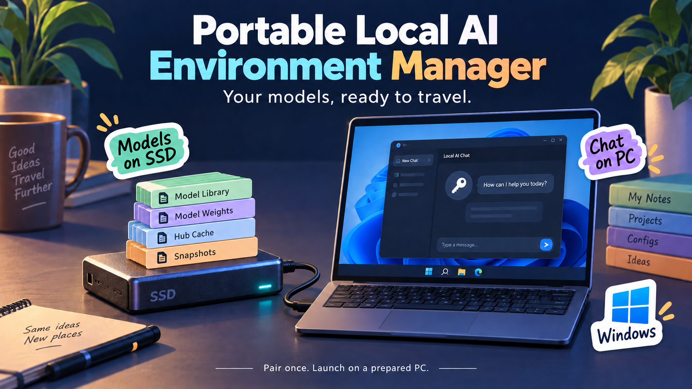
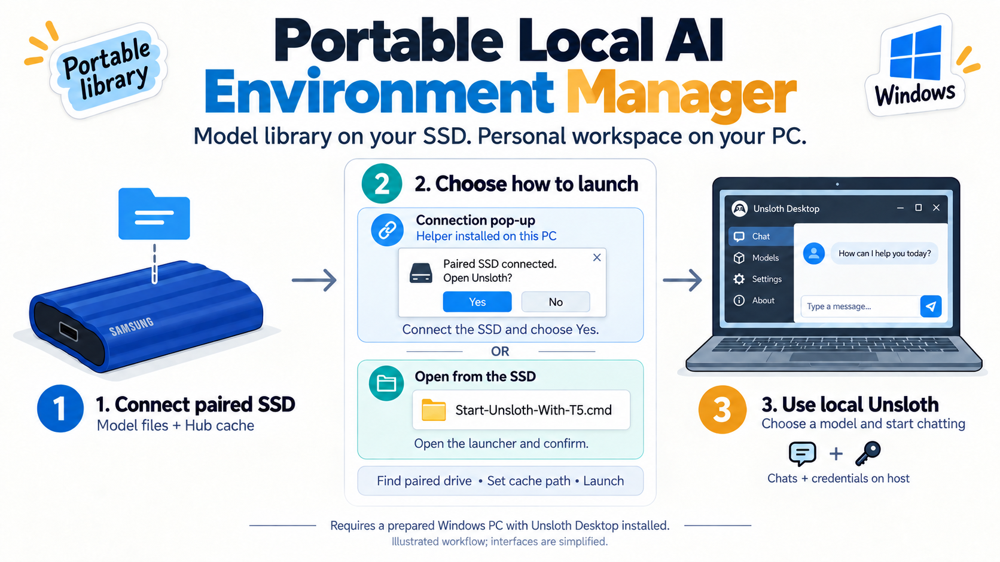
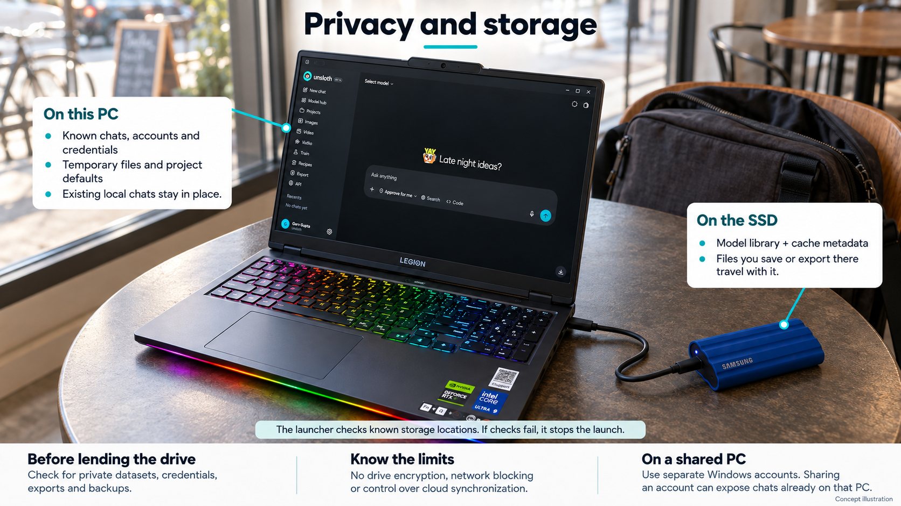
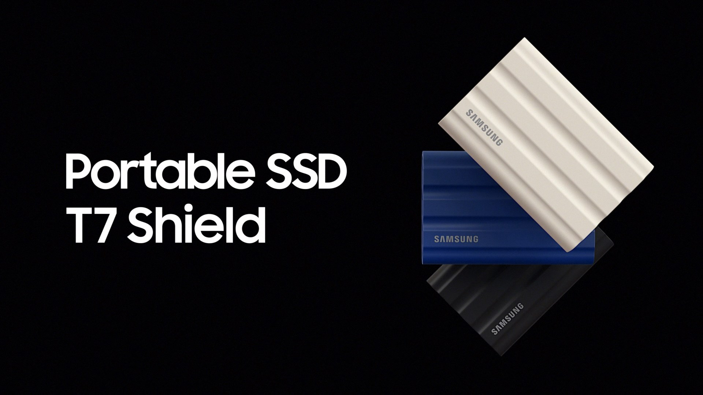

# Portable Local AI Environment Manager

<p align="center">
  
</p>

<p align="center"><sub>Concept illustration: a portable model library connected to a prepared Windows PC.</sub></p>

<p align="center"><strong>Carry your model library. Keep your personal workspace on your PC.</strong></p>

<p align="center">A small Windows launcher for using an external SSD with Unsloth Desktop.</p>

<p align="center">
  <a href="#get-started">Get started</a> &nbsp;·&nbsp; <a href="#how-it-works">How it works</a> &nbsp;·&nbsp; <a href="#privacy-and-storage">Privacy</a> &nbsp;·&nbsp; <a href="#help-and-documentation">Help</a> &nbsp;·&nbsp; <a href="#license">License</a>
</p>

**Version 0.2.1-rc.3 · Windows release candidate · [MIT license](LICENSE) · No model weights included**

## Install with npm

The optional **npm CLI (0.3.0-rc.1)** adds `portable-ai` commands for setup, diagnostics, launch, desktop shortcuts, and connection popups. It uses the existing Windows launcher; the ZIP workflow below is still available.

Requires **Windows, Node.js 22 or newer with npm, Windows PowerShell 5.1, and a working Unsloth Desktop installation**. Install directly from this GitHub repository:

```powershell
npm.cmd install --global "https://github.com/Truemaster124/Portable-Local-AI-Environment-Manager/archive/refs/heads/main.tar.gz"
portable-ai.cmd setup --drive E:
portable-ai.cmd check --drive E:
portable-ai.cmd launch --drive E:
```

Replace `E:` with your SSD's current drive letter. Setup displays the drive and cache path and asks you to type **PAIR**. It preserves existing pairings and model files and refuses to overwrite different launcher files. Installing the npm package alone does not start Unsloth or enable a background helper.

The package is **not yet published to the npm registry**; use the GitHub install command above. This release remains Windows-only. See the [npm guide](docs/npm.md) for options, updates, troubleshooting, and publishing instructions.

## Why I built this

My local AI models were filling up my internal drive, so I moved them to a Samsung T7. That freed up space, but I still had to point the apps at the right folder. Moving the SSD to another computer could change its drive letter and break those paths.

I built this launcher to handle that part. Pair the SSD once, then use it to open Unsloth with the right model folder for that session. You can keep a library off your internal drive or take it to another Windows PC without editing drive paths each time.

**Each PC still needs Unsloth Desktop, its runtime, and enough RAM or VRAM for your chosen model.** The SSD carries the model files; the PC does the computing.

## How it works

**Connect your paired SSD → Launch and confirm → Choose a model in Unsloth**

The launcher identifies the paired drive and finds its model cache. If Windows changes the drive letter from `D:` to `E:`, it follows the drive to its new location. It sets the cache path for the Unsloth session without changing Windows' global environment variables.

You can launch from the SSD yourself or enable a connection pop-up on each PC. Both routes ask for confirmation before opening Unsloth. Once the app opens, use its own controls to find, download, and remove supported models.

<p align="center">
  
</p>

<p align="center"><sub>Illustrated workflow, not actual application screenshots. Requires a prepared Windows PC; see the privacy section for storage limits.</sub></p>

## Get started

You'll need:

- A Windows PC with PowerShell 5.1 and permission to run the scripts.
- Unsloth Desktop installed, opened at least once, and ready to run a model.
- An NTFS or exFAT external SSD with room for your models and download overhead.
- An empty model folder, or an existing complete Hugging Face Hub cache.

NTFS was used in the original prototype; real-device exFAT testing is still pending. Back up important files before setting up the drive.

### 1. Copy the launcher to your SSD

[Download the repository ZIP](https://github.com/Truemaster124/Portable-Local-AI-Environment-Manager/archive/refs/heads/main.zip) and extract it. Copy `T5-Launcher/` and the six `.cmd` files to the root of your SSD:

```text
Your SSD/
├── T5-Launcher/
├── Configure-SSD.cmd
├── Check-Setup.cmd
├── Start-Unsloth-With-T5.cmd
├── Create-Desktop-Shortcut.cmd
├── Install-T5-Connection-Popup.cmd
└── Remove-T5-Connection-Popup.cmd
```

Keep these names. The `T5` filenames come from the drive I started with; a Samsung SSD is not required. If you already have a working launcher, test this version on a separate drive first.

### 2. Pair the drive

Double-click `Configure-SSD.cmd`. Choose a folder relative to the SSD, such as:

```text
AI\Models\huggingface\hub
```

Check the displayed drive and folder, then type **`PAIR`**. Setup creates the folder if needed and saves the pairing in `T5-Launcher/device.json`. Keep that device-specific file out of Git.

Run `Check-Setup.cmd` before your first launch. It checks the setup without changing it and lists anything that needs attention. A different drive letter does not require pairing again.

### 3. Launch and try a model

1. Fully quit Unsloth and its background backend.
2. Double-click `Start-Unsloth-With-T5.cmd` and accept the prompt. If asked, select the `unsloth-studio.exe` installed on this PC.
3. In Unsloth, check that the active Hub cache points to your SSD.
4. Look under **On Device** for an existing supported model. If the library is empty, download a small supported model through **Model hub**, load it, and try a prompt.

Some gated models require your own sign-in and access approval on the current PC.

<p align="center">
  <a href="Start-Unsloth-With-T5.cmd"></a>
</p>

<p align="center"><sub>This button opens the file on GitHub. To launch Unsloth, run the downloaded command from your paired SSD or use the desktop shortcut below.</sub></p>

[Full setup guide](docs/setup.md) · [Adding and removing models](docs/models.md)

## After the first setup

Connect the SSD and open **Portable Local AI** from your desktop, double-click `Start-Unsloth-With-T5.cmd` on the drive, or use the optional connection pop-up below. Keep the drive connected while Unsloth is using it.

Check the selected cache before downloading or removing models. Those changes affect the SSD library and will be visible to anyone who uses it next. Use its writable cache on one computer at a time.

Before unplugging, stop downloads and generation, unload models, quit Unsloth and its backend, and eject the drive through Windows.

<details>
<summary><strong>Add the app icon to my desktop</strong></summary>

<p align="center"></p>

After pairing and checking the SSD, run `Create-Desktop-Shortcut.cmd` from it. This creates a **Portable Local AI** shortcut with its own icon for the current Windows account. No administrator access is needed.

The shortcut finds your paired SSD each time you open it, even if its drive letter has changed. It asks before launching Unsloth and uses the same privacy checks as the original command. If the SSD is missing, it asks you to connect it and try again.

The icon and a small launcher copy live in `%LOCALAPPDATA%\PortableLocalAI-Launcher`, so they stay available when the drive is unplugged. This option does not install a background watcher. Set it up separately on each PC where you want the icon; one paired drive is supported per account.

To remove it, delete the **Portable Local AI** desktop shortcut. For replacement and cleanup steps, see [desktop shortcut setup](docs/setup.md#add-a-desktop-shortcut).

</details>

<details>
<summary><strong>Show a pop-up when I connect the SSD</strong></summary>

Run `Install-T5-Connection-Popup.cmd` from the paired SSD once per Windows account where you want this feature. The helper starts at sign-in and checks for the drive every five seconds.

When the paired drive is connected, the helper asks whether to open Unsloth. Choose **Yes** to launch or **No** to leave it closed. Declining keeps the helper quiet until the next insertion.

The drive already connected during installation is skipped, so launch manually for that first session. The pop-up needs this helper installed on the PC; it does not use USB AutoRun. One paired drive is supported per account.

To disable prompts, run `Remove-T5-Connection-Popup.cmd`. It removes the helper's verified Startup shortcut and stops the watcher. Local helper files and logs remain. You can also find the removal command in `%LOCALAPPDATA%\PortableLocalAI`.

</details>

## Privacy and storage

The SSD holds your model library and cache metadata. The launcher keeps known chat, account, credential, temporary-file, and project-default locations on the current PC. It leaves existing local chats in place and stops the launch if those location checks fail.

<p align="center">
  
</p>

Anything you deliberately save or export to the SSD still travels with it. The launcher does not encrypt the drive, block network access, or control cloud synchronization. Check for private datasets, credentials, exports, and backups before lending the drive to someone else.

On a shared PC, use separate Windows accounts. Sharing a Windows account can expose the chats already stored on that computer.

[Read the privacy details](docs/privacy.md)

## Help and documentation

<details>
<summary><strong>My models are missing</strong></summary>

Check that Unsloth is using the SSD's Hub cache and that the model is supported by the installed app. An existing cache needs complete snapshots and their file links. A folder of loose weights or GGUF files is not automatically converted into a Hub cache.

For a fresh library, try downloading a small supported model through **Model hub**. See [model management](docs/models.md) for the full steps.

</details>

<details>
<summary><strong>Unsloth will not launch, or a check fails</strong></summary>

- **Already running:** quit Unsloth and its backend, then try again.
- **App not found:** select the executable installed on this PC. A copy on the model SSD is rejected.
- **Path or privacy check failed:** run `Check-Setup.cmd` and follow the [setup guide](docs/setup.md). Do not delete links or move databases just to bypass the check.
- **Sign-in requested:** sign in with your own credentials on this PC for gated models.

Diagnostics contain local paths. Remove personal details before sharing the output.

</details>

<details>
<summary><strong>Can I use it on another PC or without internet?</strong></summary>

Another PC needs its own working Unsloth installation, runtime, and suitable hardware. You can use the same paired SSD without editing its drive path. Install the optional pop-up helper separately on each Windows account where you want it.

Offline use depends on the installed app and whether the model and runtime are fully downloaded. This launcher does not install them or block network requests.

</details>

<details>
<summary><strong>More guides and technical details</strong></summary>

- [Setup](docs/setup.md) — prepare a drive and troubleshoot a launch.
- [Model management](docs/models.md) — add and remove supported models.
- [Demo guide](docs/demo.md) — walk through the project in a presentation.
- [Design](docs/design.md) and [code walkthrough](docs/code-walkthrough.md) — see how the launcher works.
- [Testing](docs/testing.md) — automated checks and manual test steps.
- [Release checklist](docs/release-checklist.md) and [changelog](CHANGELOG.md) — release preparation and changes.

</details>

## Project status

**The launch workflow has worked on a second prepared Windows laptop.** Connecting a SanDisk SSD brought up the connection prompt. Accepting it opened Unsloth, and the SSD's models appeared under **On Device**. Garv reported this result on **11 September 2026**.

Pairing is not tied to a drive brand. Compatible Samsung T5, Samsung T7, SanDisk, and other external SSDs use the same setup steps.

The current source passes **177 automated checks** on Windows PowerShell 5.1 and PowerShell 7. A separate read-only probe passed all seven cache and credential-routing checks against the installed Unsloth backend.

[Testing and compatibility](docs/testing.md) covers the recorded results, remaining physical tests, and checks to repeat after an Unsloth update.

The launcher does not format drives, copy models, install runtimes, stop applications, or configure ComfyUI.

<details>
<summary><strong>Run the automated checks</strong></summary>

From the repository root:

```powershell
powershell.exe -NoProfile -ExecutionPolicy Bypass -File .\tests\Test-Launcher.ps1
```

The tests do not launch Unsloth, install the helper, or modify a model drive. The execution-policy flag applies only to that process; follow your organization's device policy. A Windows GitHub Actions workflow is also included. See the [testing notes](docs/testing.md) for the backend probe and manual checks.

</details>

## Credits

Created by **Garv Gupta**. Unsloth and Hugging Face provide the application and model infrastructure used by the launcher.

<details>
<summary>Samsung T7 Shield reference image</summary>

<p align="center">
  
</p>

<p align="center"><sub>Product reference supplied for this README. A Samsung drive is not required; the launcher also works with other compatible SSDs.</sub></p>

</details>

## License

The original launcher code and documentation are available under the [MIT License](LICENSE). You can use, modify, and share them, including commercially, as long as you keep the copyright and license notice. The software is provided without warranty.

This license does not replace the terms for Unsloth, Hugging Face libraries, downloaded models, or third-party material. The Samsung product image, third-party logos, and interface elements belong to their respective owners and are not covered by this project's MIT license. Their appearance does not imply endorsement.

[Back to top](#portable-local-ai-environment-manager)
