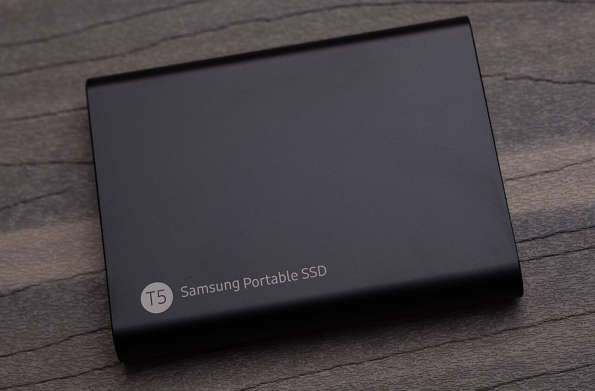

# Portable Local AI Environment Manager

Keep your model library on an external SSD and use it with Unsloth Desktop on your Windows PC. Pair the SSD once, then launch from the drive. The launcher finds its current location and sets the model-cache path for the session—even when Windows assigns a different drive letter.

<p align="center">
  
</p>

<p align="center"><sub>Photo by <a href="https://www.flickr.com/people/87296837@N00">Tony Webster</a>, via <a href="https://commons.wikimedia.org/wiki/File:Samsung_T5_Portable_External_SSD_(Solid_State_Drive)_(43544308485).jpg">Wikimedia Commons</a>, <a href="https://creativecommons.org/licenses/by/2.0/">CC BY 2.0</a>. Image unchanged.</sub></p>

**Version 0.2.0 · Windows prototype.** The source records 97 passing local automated checks; a complete second-PC acceptance test remains pending. [Testing status](docs/testing.md)

[Quick start](#quick-start) · [Everyday use](#everyday-use) · [Privacy](#privacy-and-storage) · [Documentation](#documentation)

## What it simplifies

- **No fixed drive letter:** the launcher identifies the paired SSD and finds its cache, so a change from `D:` to `E:` does not require editing paths.
- **Less repeated setup:** the launcher sets the cache path each time you open Unsloth, without changing Windows' global environment variables.
- **A simple daily routine:** connect the SSD, double-click the launcher, and confirm. You can also enable a connection prompt on each prepared PC.
- **Separate personal data:** the model cache stays on the SSD; known chat, credential, and session-state paths stay on the computer.

The SSD supplies storage. Each computer still needs a working Unsloth installation, its runtime, and enough RAM/VRAM for the selected model. Unsloth discovers and manages supported, complete models; the launcher supplies the cache location. No setup-time or inference-speed benchmark is claimed.

## Quick start

### Requirements

- Windows with Windows PowerShell 5.1, an initialized Unsloth Desktop installation, and permission to run scripts.
- An existing NTFS or exFAT external SSD with room for the library and download overhead. NTFS was used in the original prototype; exFAT still needs a real-device test.
- An empty model folder or a complete Hugging Face Hub cache. Preserve snapshot files and links when copying an existing cache; loose weight files are not a Hub cache.

Back up important files. Model weights, application installers, accounts, and drivers are not included.

### 1. Copy the launcher

Extract the repository ZIP. Copy `T5-Launcher/` and all five root-level `.cmd` files to the **root of your SSD**:

```text
Your SSD/
├── T5-Launcher/
├── Configure-SSD.cmd
├── Check-Setup.cmd
├── Start-Unsloth-With-T5.cmd
├── Install-T5-Connection-Popup.cmd
└── Remove-T5-Connection-Popup.cmd
```

Keep these names. The project started with a Samsung T5, but pairing is not tied to that brand. If the drive already has a launcher, use a separate test drive instead of overwriting it.

### 2. Pair and check

Double-click `Configure-SSD.cmd`. Choose a cache folder relative to the SSD, such as `AI\Models\huggingface\hub`. Review the displayed drive and folder, then type **`PAIR`**.

Setup creates the cache folder if needed and writes `T5-Launcher/device.json`. Keep that device-specific file out of Git. A changed drive letter does not require pairing again. Run `Check-Setup.cmd` for a read-only diagnostic before the first launch.

### 3. Launch and verify

Fully quit Unsloth **and its background backend**. Double-click `Start-Unsloth-With-T5.cmd` and accept the prompt. If asked, choose the host-installed `unsloth-studio.exe`.

Verify that Unsloth's active Hub cache points to the SSD. For an existing library, check **On Device**. For an empty library, download one small supported model through **Model hub**, then load it and try a prompt. Gated models may require sign-in on this PC.

[Detailed setup instructions](docs/setup.md) · [Model management](docs/models.md)

## Everyday use

Connect the paired SSD, open the launcher, approve the prompt, and choose a recognized model. Use Unsloth's download and removal controls only after checking the selected cache. Changes to the SSD library affect later users of that drive.

Before unplugging, stop downloads and generation, unload models, quit Unsloth and its backend, and eject the drive through Windows. Keep the SSD connected throughout the session and use its writable cache on one computer at a time.

<details>
<summary><strong>Enable or disable connection prompts</strong></summary>

Run `Install-T5-Connection-Popup.cmd` from the paired SSD once on each Windows account where you want prompts. The local helper starts at sign-in and checks every five seconds. It asks before launching on a newly detected matching drive; declining keeps it quiet for that insertion.

The drive connected during installation is skipped, so launch manually for that first session. A PC without the helper needs a double-click on the launcher. This is not USB AutoRun. The helper supports one paired drive per account.

Run `Remove-T5-Connection-Popup.cmd` to disable it. This removes its verified Startup shortcut and stops the watcher; local helper files and logs remain. The removal command is also available in `%LOCALAPPDATA%\PortableLocalAI`.

</details>

## Privacy and storage

The SSD holds the model library and cache metadata. The launcher keeps known chat, authentication, credential, temporary-file, and project-default paths on the host. It stops if its host-state checks fail and leaves existing local chats in place.

This controls storage locations; it does not encrypt the drive, block network access, control cloud synchronization, or prevent manual exports. Anything saved to the SSD travels with it. Keep private models, datasets, credentials, and backups off a shared drive. [Privacy boundary](docs/privacy.md)

## Troubleshooting and limits

<details>
<summary><strong>Models missing or launch blocked?</strong></summary>

- **Missing models:** check the active SSD cache path, complete snapshots, and model compatibility. Loose GGUF files are not converted into Hub entries.
- **App already running:** quit Unsloth and its backend, then retry.
- **App not found:** select the executable installed on the PC; an app copy on the model SSD is rejected.
- **Path or privacy failure:** run `Check-Setup.cmd` and review the layout. Do not delete links or move databases just to silence the check.
- **Login requested:** use your own host credentials for gated models.

Diagnostic output includes local paths; redact them before sharing. [Setup guide](docs/setup.md)

</details>

These scripts target Windows. They do not install runtimes, format drives, copy models, kill applications, or configure ComfyUI. Offline operation depends on the installed application and a complete model/runtime. Network or redirected profiles and nonstandard layouts need separate review.

The original prototype used Unsloth Desktop `0.1.806-beta`; later versions need retesting. Physical second-PC, exFAT, and real download/delete acceptance tests remain pending. Keep any working original T5 prototype in place and do not enable both watchers together. [Testing notes](docs/testing.md)

## Development

Run the included checks from the repository root:

```powershell
powershell.exe -NoProfile -ExecutionPolicy Bypass -File .\tests\Test-Launcher.ps1
```

The tests do not launch Unsloth, install a helper, or modify a model drive. The execution-policy flag applies to that process; follow your organization's device policy. A Windows GitHub Actions workflow is included. The installed-backend probe and manual acceptance steps are documented in [testing notes](docs/testing.md).

## Documentation

| Task | Guide |
| --- | --- |
| Prepare a drive and troubleshoot setup | [Setup](docs/setup.md) |
| Add or remove models | [Model management](docs/models.md) |
| Demonstrate the workflow | [Demo](docs/demo.md) |
| Understand storage and personal data | [Privacy](docs/privacy.md) |
| Understand the implementation | [Design](docs/design.md) · [Code walkthrough](docs/code-walkthrough.md) |
| Validate a release | [Testing](docs/testing.md) · [Release checklist](docs/release-checklist.md) |
| Review changes | [Changelog](CHANGELOG.md) |

## Credits and license

Created by **Garv Gupta**, with AI assistance. Unsloth and Hugging Face provide the application and model infrastructure; this repository provides the launcher integration. Photo attribution is shown above.

A code license has not been selected. Complete the [release checklist](docs/release-checklist.md) before publishing a reusable release.
