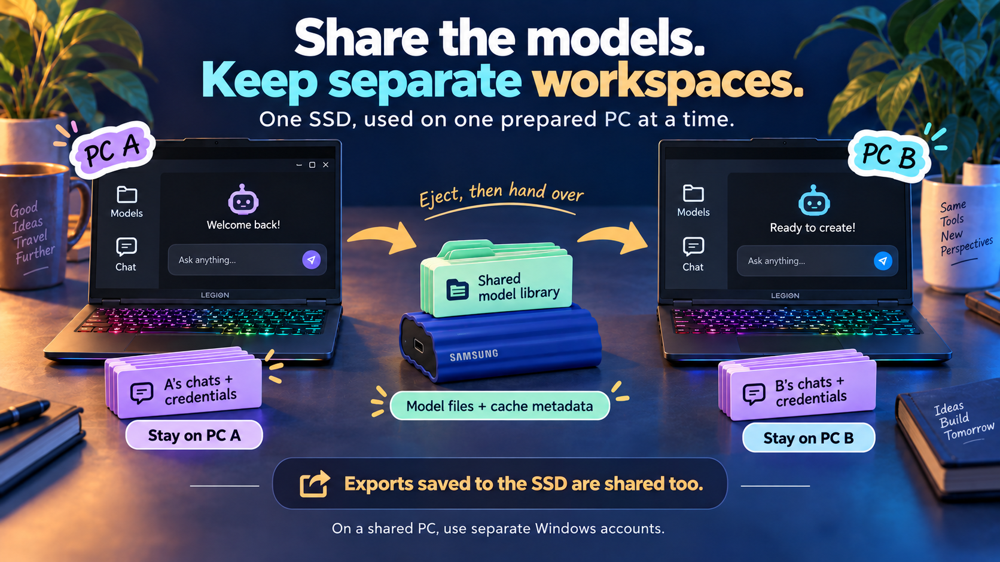

# Privacy when two people share the drive

  

## The intended boundary

Person A uses the SSD on PC A, ejects it, and gives it to person B on PC B. Both can see the shared model library. Person B should not receive person A's conversations merely by launching with that library.

The launcher does not transfer a Windows profile, chat database or authentication database. This is **host-local state**, not anonymous or trace-free computing.

## What version 0.2 does

- Selects only the model Hub cache on the SSD.
- Sets a dedicated local `HF_HOME` and `HF_TOKEN_PATH` under `%LOCALAPPDATA%\PortableLocalAI\HuggingFace` for the new application process.
- Removes inherited `HF_TOKEN` and `HUGGING_FACE_HUB_TOKEN` variables from that process. It does not inspect or copy their values. Existing credentials stored by Unsloth locally are still the host user's credentials.
- Keeps known temporary, auxiliary-cache, document and project defaults in the current user's local launcher directory.
- Pins the Studio root to the validated local location: an explicit supported override, or `%USERPROFILE%\.unsloth\studio`. It does not relocate or erase existing chats.
- Rejects known private-state paths outside the local user profile or through junctions/symbolic links. Failure stops the launch instead of trying to repair someone else's setup.
- Leaves global Windows environment variables unchanged.

The Hub library separates repository cache configuration from credential storage; using `HF_HOME` for the entire shared drive would mix those concerns. [Hugging Face environment reference](https://huggingface.co/docs/huggingface_hub/package_reference/environment_variables).

## What the next person can still learn

Anyone able to read the SSD can see its model names, weight files, cache metadata, additions, removals and timestamps. A private fine-tuned model can itself contain sensitive information. Sharing writable storage means sharing those contents and changes.

Any chats, generated files, tokens, logs or backups you manually save to the SSD are also visible. The launcher neither audits every existing file nor securely erases old data. Prefer a fresh model-only collection over a copy of an entire application drive.

The Hub cache is not a file-type access rule: applications can also put downloaded dataset or Space repositories there. A local `HF_DATASETS_CACHE` keeps the known processed-dataset cache local, but it does not force every original dataset download off the shared Hub cache. Do not use sensitive dataset or private-repository workflows in this shared-library session without checking their storage paths.

It also does not encrypt the drive, hide files from its owner, prevent an application update from introducing a new path, block cloud features, or sandbox model code. Only run trusted models on a trusted computer. A malicious application or administrator can bypass these routing choices.

## What stays on the computer

Unsloth can retain chats, account information, uploaded files and other state locally after the SSD is removed. The launcher also retains local diagnostics and caches. There is no automatic logout or cleanup on ejection.

On a shared PC, use separate Windows accounts. Reusing the same Windows account can show the previous local user's chats even though the SSD carried none. Cloud/account synchronization is another possible route for history; this launcher does not control it.

[See the storage overview in the README](../README.md#privacy-and-storage).

## How to verify the two-computer boundary

Use a disposable model collection. Create a harmless unique test phrase in a chat on PC A. Close and eject correctly. On PC B, check that the phrase is absent from Unsloth history, and inspect the SSD for exported chats, databases or logs. A missing UI entry alone isn't a full privacy audit.

Repeat after changing Unsloth versions or storage settings. This acceptance test is still pending for the generic release. Do not claim "no previous-use traces"; the actual claim is "model sharing with guarded host-local application state."
